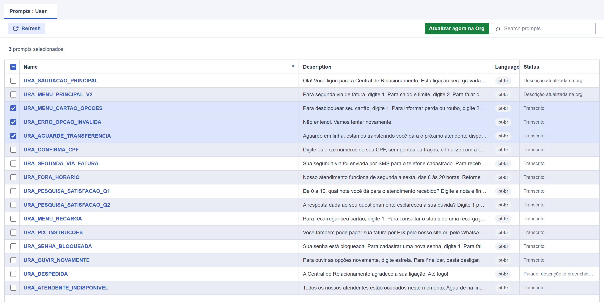

# Genesys Cloud — Transcrição de Prompts

Cataloga os **prompts de áudio da sua org Genesys Cloud que estão sem descrição**, transcreve cada áudio localmente com Whisper e mostra o resultado numa tabela HTML. Se você quiser, um botão preenche o campo *Description* de volta na org — só nos prompts que você selecionar e só depois de confirmar.

Tudo roda na sua máquina: nenhum áudio sai do computador, nenhum serviço externo de transcrição é usado.



> Dados de exemplo. A tabela é gerada localmente e imita a tela de *Prompts* do Architect.

---

## Por que isso existe

Uma org com centenas de prompts de URA vira uma lista de nomes tipo `IVR_MENU_PRINCIPAL_V3` sem nenhuma pista do que o áudio realmente fala. Descobrir isso exige baixar e ouvir um por um. Este script faz esse trabalho e devolve uma tabela pesquisável — e, opcionalmente, escreve a transcrição como descrição do prompt na própria org.

---

## Como funciona

1. Autentica na Platform API (OAuth **Client Credentials**).
2. Lista todos os prompts do Architect e filtra os que estão **sem descrição**.
3. Baixa o áudio de cada um em `audios_baixados/`.
4. Transcreve com **faster-whisper** (modelo `small`, CPU), usando um dicionário de contexto de URA em português para acertar termos como "tecle", "opção", "segunda via", "PIX".
5. Gera `prompts_sem_descricao_transcritos.csv` e `prompts_sem_descricao_transcritos.html`.
6. *(opcional)* Com `--servidor`, abre a tabela no navegador com um botão que grava as descrições na org.

---

## Requisitos

- **Python 3.9+** (testado no 3.12)
- Uma org Genesys Cloud e permissão para criar um OAuth Client
- ~500 MB de espaço para o modelo Whisper, baixado automaticamente no primeiro uso
- Só CPU — não precisa de GPU

---

## Instalação

Clone o repositório e **entre na pasta antes de rodar qualquer comando** — todos os comandos abaixo assumem que você está dentro dela:

```bash
git clone https://github.com/GabrielReact/Genesys-Cloude-Prompt-Transcription.git
cd Genesys-Cloude-Prompt-Transcription
```

### Windows (PowerShell ou CMD)

```powershell
python -m venv .venv
.venv\Scripts\activate
python -m pip install --upgrade pip
python -m pip install -r requirements.txt
```

> **Use `python`, não `python3`.** No Windows, `python3` costuma cair no atalho da Microsoft Store, que pode ser um interpretador **diferente** do que você instalou (ou nem existir de verdade) — foi assim que apareceu o `Could not open requirements file`. Se `python` não funcionar, use o launcher oficial: `py -3 -m pip install -r requirements.txt`.

### Linux / macOS

```bash
python3 -m venv .venv
source .venv/bin/activate
python3 -m pip install -r requirements.txt
```

> O ambiente virtual (`.venv`) é opcional, mas evita conflito com outros projetos. Sem ele, acrescente `--user` ao `pip install`.

---

## Configuração

### 1. Crie o OAuth Client no Genesys Cloud

Em **Admin → Integrations → OAuth → Add Client**:

- **Grant Type:** `Client Credentials`
- **Roles/permissões:**
  - `Architect > User Prompt > View` — obrigatório (ler e baixar os prompts)
  - `Architect > User Prompt > Edit` — só se você for usar o botão de atualizar descrições

Anote o **Client ID** e o **Client Secret**.

### 2. Preencha o `.env`

Copie o modelo e edite:

```bash
# Windows
copy .env.example .env
# Linux / macOS
cp .env.example .env
```

```ini
GENESYS_CLIENT_ID=seu-client-id
GENESYS_CLIENT_SECRET=seu-client-secret
GENESYS_REGION_HOST=https://api.sae1.pure.cloud
```

O host é o da **sua região** — `api.sae1.pure.cloud` (São Paulo), `api.mypurecloud.com` (US East), `api.mypurecloud.ie` (EU West), etc. Pode informar com ou sem `https://`.

---

## Uso

Troque `python` por `python3` se estiver no Linux/macOS.

```bash
# Teste rápido: lista e transcreve apenas 5 prompts
python catalogar_prompts_sem_descricao.py --limite 5

# Processa todos os prompts sem descrição
python catalogar_prompts_sem_descricao.py

# Só monta a tabela, sem baixar nem transcrever (bem rápido, bom pra ver o volume)
python catalogar_prompts_sem_descricao.py --somente-listar

# Abre a tabela no navegador e habilita a atualização na org
python catalogar_prompts_sem_descricao.py --servidor
```

| Flag | O que faz |
|---|---|
| `--limite N` | Processa no máximo N prompts (`0` = todos, padrão) |
| `--somente-listar` | Gera a tabela sem baixar áudio nem transcrever |
| `--servidor` | Sobe um servidor local em `127.0.0.1` e abre a tabela no navegador |
| `--porta N` | Porta do servidor local (padrão `8765`) |

A primeira execução demora mais: o modelo Whisper (~460 MB) é baixado e fica em cache para as próximas.

### O modo `--servidor`

Abre a tabela com três recursos a mais que o HTML solto:

- **Busca** por nome, transcrição ou status
- **Refresh** — relê a org e traz prompts novos que ainda não estão na tabela (só leitura); eles entram como *Pendente de transcrição* — rode o script pela linha de comando de novo para transcrevê-los
- **Atualizar agora na Org** — grava a transcrição no campo *Description* dos prompts marcados

Rode o `--servidor` sempre da mesma pasta: ele lê o CSV e o HTML que já foram gerados ali.

---

## Segurança e escopo da escrita

Este ponto é o que torna a ferramenta segura de rodar numa org de produção:

- **O modo padrão é 100% leitura.** Sem `--servidor`, nada é escrito na org.
- A escrita só existe pelo botão do HTML local e **exige confirmação no navegador**.
- **Só descrições vazias são preenchidas.** Antes de cada `PUT`, o prompt é relido na org: se alguém já escreveu uma descrição no meio do caminho, ele é pulado.
- O script **nunca** altera nome, áudio, recurso de idioma, nem exclui prompt algum.
- O servidor escuta apenas em `127.0.0.1` — não fica exposto na rede.
- O `.env` está no `.gitignore`. Nunca comite Client Secret.

---

## Arquivos gerados

| Arquivo | Conteúdo |
|---|---|
| `audios_baixados/` | Áudios baixados, nomeados `{id-do-prompt}_{idioma}` |
| `prompts_sem_descricao_transcritos.csv` | Tabela completa (UTF-8 BOM, abre direto no Excel) |
| `prompts_sem_descricao_transcritos.html` | Mesma tabela, navegável e pesquisável no navegador |

Nenhum dos três vai para o Git — todos estão no `.gitignore`.

---

## Problemas comuns

| Sintoma | Causa e solução |
|---|---|
| `Could not open requirements file` | Você não está dentro da pasta do projeto, ou o `python3` do Windows caiu no atalho da Microsoft Store. Faça `cd` na pasta e use `python` / `py -3`. |
| `Configuração não encontrada: ...\.env` | O `.env` não foi criado. Copie o `.env.example`. |
| `HTTP 400 invalid_client` no token | Client ID/Secret errados, ou o `GENESYS_REGION_HOST` é de outra região. |
| `HTTP 403` ao atualizar | Falta a permissão `Architect > User Prompt > Edit` no OAuth Client. |
| `Address already in use` | A porta `8765` está ocupada. Use `--porta 8080`. |
| Transcrição lenta | Normal em CPU. Use `--limite` para testar antes de rodar tudo. |

---

## Stack

Python 3 · [faster-whisper](https://github.com/SYSTRAN/faster-whisper) (CTranslate2) · Genesys Cloud Platform API v2 · `http.server` e `urllib` da biblioteca padrão — sem framework web e sem SDK.
